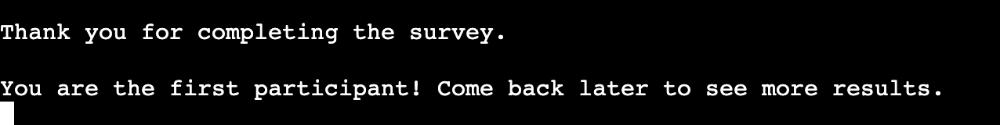

# Enviro

Enviro is a Python terminal survey, which runs the Code Institute mock terminal on Heroku.

The user will answer four questions on the topic of climate change. After completion, the answers are automatically compiled in a separate google sheet document.

Here is the live version of my project:

https://enviro-heroku.herokuapp.com/

Here is the google sheet:

https://docs.google.com/spreadsheets/d/1Rcz8dzrTXvPHjxwoMHBXs2aZOEnhtcarwN_9A1e86hA/edit?usp=sharing

# How to complete the survey

After clicking on 'run program', the user is prompted with the following statement: 'Please answer the following questions by choosing one of the provided answers.' The program then shows a question with a list of 4 answers to choose from. The user simply needs to type the answer from the list and press enter and repeat for all 4 questions.

After completing the survey, the answers are sent to the linked google sheet where they are compiled automatically for the survey analyst. In the google sheet, the survey analyst can examine the count for each answer and see which ones are the most frequent.

# Features

## Existing features

- The questions are displayed one at a time with multiple choice answers
- Accepts user inputs
- Input validation and error-checking
    - The answer must be one of the multiple answers provided (a,b,c,d)
    - The survey will return the user's input if something else is provided

    
    
- Data sent to linked google sheet
- The quantity of participants is displayed after completion of the survey
- The most popular answers are displayed at the end

    

- The user is notified if they are the first to participate to the survey

    

## Future features

- Ability for the participant to go back and change their answer
- View multiple most popular answers

# Data Model

I decided to use a python list to hold the questions and multiple choice answers. The survey uses a for loop in order to collect the answers and verify if they are entered correctly by the user. The answers are sent to the google sheet using the SHEET variable and google sheet API.

# Testing

I have manually tested this project by doing the following:
- Typed invalid inputs (i.e., numbers and typos) when specific strings are expected
- Tested in my local terminal and the Code Institute Heroku terminal
- No errors were found when passing through the official https://pep8ci.herokuapp.com/

## Bugs

### Solved bugs

- The user's wrong answers were being appended to the google sheet. I had copied my code from the if statement. To fix this problem, I simply removed `answers_list.append(answer)` from the else statement.
- The `endMessage()` function was returning both "You are the first participant! Come back later to see more results" and the results. The issue was fixed by adding `sys.exit()`
- The `error message ImportError: No module named gspread` was fixed by installing gspread again
- The `error TypeError: 'list' object cannot be interpreted as an integer` was fixed by creating a for loop to parse each list item into a new list as integers.

## Bugs remaining

- No bugs remaining.

# Deployment

This project was deployed using Code Institute's mock terminal heroku.

- steps for deployment:
    - Fork or clone this repository
    - Create a new heroku app
    - Set the buildpacks to `Python` and `NodeJS` in that order
    - Link the heroku app to the repository
    - Click on <strong>Deploy</strong>

# Credits

Code Institute for the deployment terminal

https://techsini.com/multi-mockup/index.php for the README.md multi-device mockup image

https://realpython.com/python-quiz-application/ for the tutorial

I used stackoverflow to understand and fix errors. I used mainly these:
https://stackoverflow.com/questions/47271232/use-of-try-except-for-input-validation
https://stackoverflow.com/questions/3594514/how-to-find-most-common-elements-of-a-list